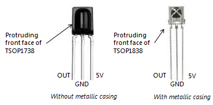
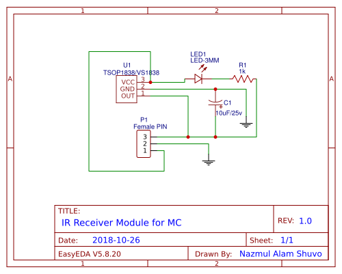
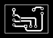
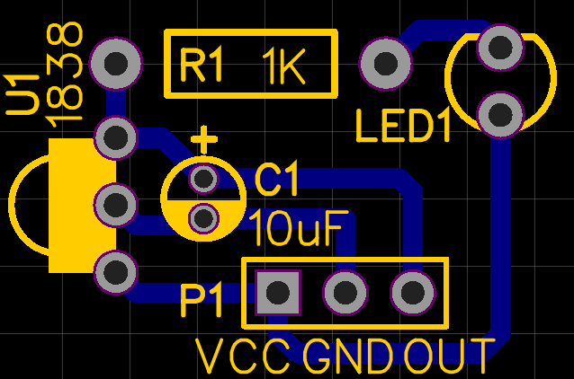
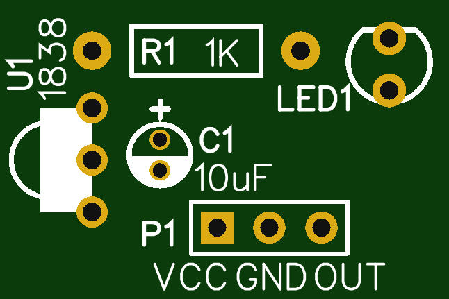

# IR-Receiver-Arduino-Modules
All kind of Arduino Uno Modules circuit Diagram, Library, Installation process and much more useful things in here.

## Pinout VS1838/TSOP1838 IR:

## Circuit Diagram:

## PCB Layout:

## HappY Electronics :D
 :+1:
